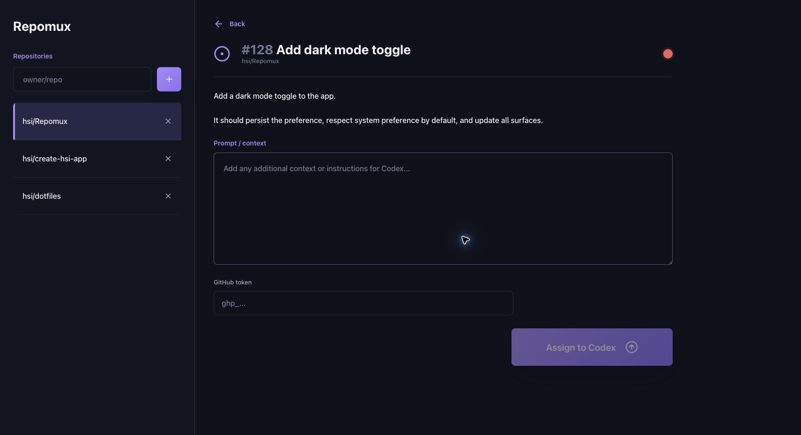

<div align="center">
  

<h1>Repomux</h1>

Assign GitHub work to coding agents without babysitting the queue.


</div>

## Why Repomux

- **One queue, less context switching:** Track repositories, prompts, and assignment state from one workspace instead of bouncing between tabs.
- **GitHub-native handoff:** Repomux uses your GitHub identity to queue work, post prompt comments, and apply the `codex-ready` label where your agents expect it.
- **Personal by default:** Repomux uses your signed-in GitHub identity and server-side session cookie so each operator only sees and edits their own queue.
- **Built for overnight runs:** The login wall, repository list, and work panel are optimized for quick triage when you want to assign work and step away.

## Install

```bash
bun install
```

## Development

Start the app:

```bash
bun run dev
```

Run the full local check:

```bash
bun run check
```

Render the fallback Codex automation prompt for this checkout:

```bash
bun run setup:codex
```

## Configure

Create `.env.local` or `.env` with:

```bash
NEXT_PUBLIC_GITHUB_OAUTH_SCOPE=repo
GITHUB_CLIENT_ID=
GITHUB_CLIENT_SECRET=
GITHUB_OAUTH_REDIRECT_URI=
```

Leave `GITHUB_OAUTH_REDIRECT_URI` empty unless you need to force a specific callback URL. By default, Repomux uses `/api/github/callback` on the current origin.

Create a GitHub OAuth App and set its callback URL to your Repomux deployment, for example:

```bash
http://localhost:3000/api/github/callback
```

Repomux signs in through Next route handlers, stores the GitHub access token in an HTTP-only cookie, then uses server-side API routes to read the queue, post the prompt comment, and add the `codex-ready` label.

If you only need public repositories, set `NEXT_PUBLIC_GITHUB_OAUTH_SCOPE=public_repo`. Use `repo` when private repository access is required.

## Codex Automation

Repomux now ships a reusable automation template and a repo-local skill for native Codex automation setup.
The automation itself is GitHub-driven: it looks for open issues or pull requests labeled `codex-ready` and processes one item at a time. Repomux is optional operator UI, not a runtime dependency.

Preferred setup:

1. Open Repomux and click `Copy prompt`.
2. Copy the setup prompt shown there.
3. Paste that prompt into Codex from anywhere. A local Repomux checkout is not required.
4. Review the suggested automation draft and confirm:
    - the GitHub search scope
    - the local automation workspace root
    - the local repository root
    - the schedule and any optional settings you want to keep control over

Any local project folder can be used as the automation workspace root. The local repository root can be the same folder or a different one, as long as Codex can clone and reuse the target repositories there.

The repo-local skill at [.agents/skills/codex-ready-github-automation/SKILL.md](/Users/hsi/Projects/Current/Repomux/.agents/skills/codex-ready-github-automation/SKILL.md) tells Codex to use the native automation flow and prefill the current checkout path, local repository root, and GitHub scope hint.
If you do have this repo open in Codex, that skill makes the setup faster, but it is optional.

Repo-local fallback:

- Run `bun run setup:codex` to render a prompt file at `.codex/repomux-automation.prompt.md` inside the checkout.
- Paste that rendered prompt into a Codex automation only if you want the repo-local renderer to prefill values for this checkout.

By default the generated prompt assumes:

- the automation workspace root is the current checkout
- the local repository root must be set explicitly before the automation is safe to save
- the GitHub search scope must be set explicitly before the automation is safe to save

Override those defaults when needed:

```bash
bun run setup:codex -- --automation-workspace-root /absolute/path/to/workspace --worktree-root /absolute/path/for/repos --github-scope-hint org:my-org --output /absolute/path/repomux-automation.prompt.md
```

The checked-in template stays generic for every Repomux user. Codex or the fallback renderer writes machine-specific paths only at setup time.

Important caveats for shared users:

- The automation does not need Repomux. GitHub label search is the queue source of truth.
- Repomux is optional. Use it when you want queue triage UI or a convenient way to add the `## Codex prompt` comment.
- A Codex automation still runs on the user's local machine. It needs a real local directory where target repositories can be cloned or reused.
- The automation workspace root can be any local project folder. It does not need to be a Repomux checkout.
- This workflow also depends on GitHub being set up in two places:
    - Codex/ChatGPT must have GitHub connected and approved for the required repositories.
    - The local machine may also need working git credentials and `gh auth login` for clone, push, pull request, and comment flows.
- The automation also needs an explicit GitHub search scope such as `repo:owner/name`, `org:my-org`, or `user:my-user`.
- Do not assume another user's repository root matches your machine. Confirm it before creating or saving an automation.
- The repo-local skill only helps when Codex is opened on a Repomux checkout. Without a local checkout, ask Codex directly for the same GitHub-driven automation and confirm the scope plus local repository root during setup.
- If GitHub is missing or blocked, the automation should stop with either `GitHub connector setup required` or `local GitHub auth required` instead of continuing.

## Local OAuth

Use a GitHub OAuth App for local development.

1. Set its callback URL to `http://localhost:3000/api/github/callback`.
2. Fill in `GITHUB_CLIENT_ID` and `GITHUB_CLIENT_SECRET` in `.env.local`.
3. Start the app with `bun run dev`.

Repomux does not depend on a separate application database for authentication or repository storage.
